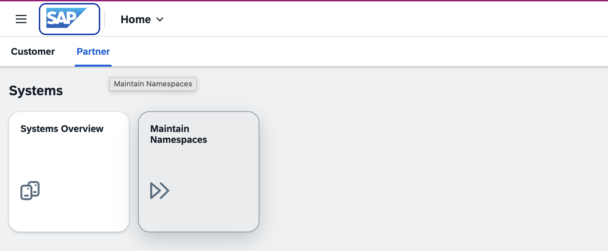
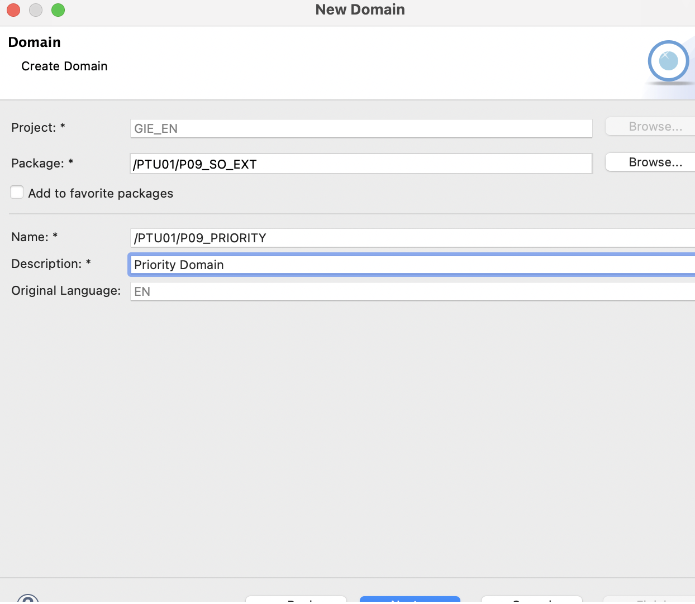

# Setup Exercise — Software Component & Sales Order Extension

> **⚠️ Prerequisite — Do Not Perform During the Training**
>
> This setup exercise is a **prerequisite for the Partner Training** and will be **performed by SAP in advance**. As a partner, you do **not** need to execute these steps during the workshop. All objects mentioned in this exercise will already be available in your system when you start.
>
> This document is provided **for reference only**, so you can understand what was set up and reproduce it later in your own landscape if needed. The workshop itself starts at **[Exercise 1 — Business Configuration Maintenance Object](01_Exercise.md)**.

This setup exercise prepares the prerequisites for the workshop: a Software Component for transport, the Package, the `Priority` domain and data element, the append structure that adds the Priority field to the standard Sales Order, the extension views and the Priority value help.

> **Note:** Replace `PW#` with the namespace of your system (`PW1`, `PW2`, or `PW3`) and `##` with your two-digit partner/group number wherever it appears (e.g., `09`).

---

## Request and Install Namespace

1. Open **Landscape Portal**, go to the **Partner** section and open the **Maintain Namespaces** app.

   

2. Click **Request Namespace** and fill in the details as shown below, then click **Request Namespace**:

   

3. Go to the **Systems** tab of the **Maintain Namespaces** application. Choose the system in which you want to install this namespace and click **Install**.

   > **Note:** It will take some time to install. Keep refreshing.

---

## Create Software Component

1. Search for the **Manage Software Components** app in the search bar and open the app.

2. Click **Create**.

3. Choose Namespace as `/PW#/` and enter:
   - **Name:** `P##EXT`
   - **Description:** P## Sales Order Extension
   - **Type:** Development

   

4. Click **Create**.

5. Click the **Clone** button.

   

   Again, click **Clone** in the popup.

   

6. The **Cloned** status will be set to **YES** in the header.

---

## Create Package

Creating a Software Component creates a structure package in the system. But to create development objects, we need to create a development package on top of the structure package.

### Add Structure Package to Favorite Packages

1. Log in to ADT and right-click on **Favorite Packages** in the Project Explorer section.

2. Choose **Add Package** and provide the software component name `/PW#/P##EXT`.

3. Click **OK**.

   

### Create Development Package

1. From the list of Favorite Packages in Project Explorer, right-click on the newly added package and choose **New → ABAP Package**.

2. Provide:
   - **Package Name:** `/PW#/P##_SO_EXT`
   - **Description:** P## Sales Order Extension Package

   Click **Next**. Click **Next** again.

3. Choose the option **Create New Request**. Provide **Request Description** as "P## SO Extension" and click **Finish**.

   

---

## Create Priority Domain

1. Right-click on the Package name created above. Choose **New → Other ABAP Repository Object** and search for **Domain**.

   

2. Click **Next** and provide:
   - **Name:** `/PW#/P##_PRIORITY`
   - **Description:** P## Sales Order Priority

   Click **Next**.

3. Choose the TR and click **Finish**.

4. Provide the following Domain details:
   - **Data Type:** CHAR
   - **Length:** 4
   - **Output Length:** 4

   | Fixed Value | Description |
   |-------------|-------------|
   | LOW         | Low         |
   | MED         | Medium      |
   | HIGH        | High        |

   

5. Click **Activate**.

---

## Create Priority Data Element

1. Right-click on the Package name. Choose **New → Other ABAP Repository Object** and search for **Data Element**.

2. Click **Next** and provide:
   - **Name:** `/PW#/P##_PRIORITY`
   - **Description:** P## Sales Order Priority

   Click **Next**.

3. Choose the TR and click **Finish**.

4. Provide the following data element details:
   - **Category:** Domain
   - **Type Name:** Search for the domain name created earlier `/PW#/P##_PRIORITY`.

   

5. Click **Activate**.

---

## Create Append Structure

1. Right-click on the Package name. Choose **New → Other ABAP Repository Object** and search for **Structure**.

2. Provide:
   - **Name:** `/PW#/P##_SO_APPND`
   - **Description:** P## Append Structure for Sales Order Priority

3. Click **Next**.

4. Choose the TR and click **Finish**.

5. Copy-paste the following code for creating the append structure (replace the name of field, data element and structure if needed):

   ```cds
   @EndUserText.label : 'P## Append Structure for Sales Order Priority'
   @AbapCatalog.enhancement.category : #NOT_EXTENSIBLE
   extend type sdsalesdoc_incl_eew_ps with /pw#/p##_so_appnd {

     /pw#/p##_priority_sdh : /pw#/p##_priority;

   }
   ```

6. Activate the structure.

---

## Create Extension Views

### Extend E_SalesDocumentBasic

1. Right-click on the Package name. Choose **New → Other ABAP Repository Object** and search for **Data Definition**.

2. Provide:
   - **Name:** `/PW#/P##_E_SD_EXT`
   - **Description:** P## E_SalesDocumentBasic Extension

3. Click **Next**.

4. Choose the TR and click **Finish**.

5. Copy-paste the following code (replace the name `/pw#/p##_priority_sdh` and alias `/pw#/p##_priority_sdh` accordingly):

   ```cds
   extend view entity E_SalesDocumentBasic with {
        Persistence./pw#/p##_priority_sdh as /pw#/p##_priority_sdh
   }
   ```

6. Click **Activate**.

### Extend R_SalesOrderTP, I_SalesOrderTP and C_SalesOrderManage

Similarly, create Data Definitions `/PW#/P##_R_SO_EXT`, `/PW#/P##_I_SO_EXT` and `/PW#/P##_C_SO_EXT` respectively.

**`/PW#/P##_R_SO_EXT`:**

```cds
extend view entity R_SalesOrderTP with {
    _Extension./pw#/p##_priority_sdh as /pw#/p##_priority_sdh
}
```

**`/PW#/P##_I_SO_EXT`:**

```cds
extend view entity I_SalesOrderTP with {
    SalesOrder./pw#/p##_priority_sdh as /pw#/p##_priority_sdh
}
```

**`/PW#/P##_C_SO_EXT`:**

```cds
extend view C_SalesOrderManage with /PW#/P##_C_SO_EXT {
    @UI.lineItem: [{ position: 70, importance: #HIGH, label: 'P## Priority' }]
    @UI.fieldGroup: [{ qualifier: 'OrderData', position: 70, label: 'P## Priority' }]
    @UI.textArrangement: #TEXT_ONLY
    SalesOrder./pw#/p##_priority_sdh as /pw#/p##_priority_sdh
}
```

---

## Create Value Help

1. Create a new data definition for the Priority value help in the Sales Order app and replace the names accordingly:

   ```cds
   @AbapCatalog.sqlViewName: '/PW#/P##_I_PR'
   @AccessControl.authorizationCheck: #NOT_REQUIRED
   @ObjectModel.dataCategory:#VALUE_HELP
   @EndUserText.label: 'P## Priority Value Help'
   @ObjectModel.resultSet.sizeCategory: #XS
   @Metadata.ignorePropagatedAnnotations: true
   define view /PW#/P##_I_Priority_VH as select from DDCDS_CUSTOMER_DOMAIN_VALUE_T( p_domain_name : '/PW#/P##_PRIORITY' )
   {
     @UI.hidden: true
     key domain_name,
     @UI.hidden: true
     @Semantics.language: true
     key language,
     @EndUserText.label: 'Priority'
     @ObjectModel.text.element: [ 'text' ]
     key value_low,
     @EndUserText.label: 'Description'
     @Semantics.text: true
     text
   }
   ```

2. Save and activate.

3. Add the following annotation in the C view created above `/PW#/P##_C_SO_EXT`:

   ```cds
   @Consumption.valueHelpDefinition: [{ entity: {element: 'value_low', name : '/PW#/P##_I_Priority_VH' } }]
   ```

4. Save and activate.

## Create HTTP Destination to your development tenant

The Destination service lets you find the information that is required to access a remote service or system from your cloud application.

1. Go to your SAP BTP global account cockpit and open the subaccount.

2. Choose **Connectivity > Destinations**.

3. Choose **Create**. In the **Create New Destination** dialog, select **From Scratch** and choose **Create**.

<p align="center">
    
</p>

4. In the **Destination Details** section, enter the following detail:
    - **Name**: Enter the respective development tenant name followed by _DEV. For example BGS_DEV or BI3_DEV or BCG_DEV.
    - **Type**: From the dropdown menu, select `HTTP`.
    - Provide a description for the destination. This is an optional field.
    - **Proxy Type**: From the dropdown menu, select `Internet`.
    - **URL**: Specify the destination URL. Make sure to use the API endpoint of the SAP S/4HANA Cloud Public Edition system (…-api.lab.s4hana…) in the URL field.
    - **Authentication**: From the dropdown menu, select `SAMLAssertion`.

    

5. Under **Client Trust Store configuration** keep **Use default client trust store** as checked.

6. Under the **SAML Properties** section provide the following values:
    - **AuthnContextClassRef**: urn:oasis:names:tc:SAML:2.0:ac:classes:PreviousSession​.
    - **Audience:** System URL.
    - **Name Id Format**: urn:oasis:names:tc:SAML:1.1:nameid-format:emailAddress.

<p align="center">
    
</p>

7. Add the following **Additional Properties**:
    | Key                      | Value                                |
    | ------------------------ | ------------------------------------ |
    | HTML5.DynamicDestination | true                                 |
    | HTML5.Timeout            | 60000                                |
    | WebIDEEnabled            | true                                 |
    | WebIDEUsage              | odata_abap,ui5_execute_abap,dev_abap |

<p align="center">
    
</p>

8. Then click **Create**.

9. Click **Destination Trust** (choose **Connectivity > Destinations Trust**).

10. Click **Export**.

11. Open the Fiori launchpad of your development tenant.

12. Open **Communication Systems** app and click **New** and provide **system ID**.

<p align="center">
    
</p>

13. In **Technical Data** section, set **Inbound Only**.
14. Under **Identity Provider**, switch on **SAML Bearer Assertion Provider**.
15. Choose **Upload Signing Certificate** and upload the previously downloaded **Destination Trust** file.
16. Manually copy the **CN value** (value after CN=) from **Signing Certificate Subject** and add it to **SAML Bearer Issuer**.
