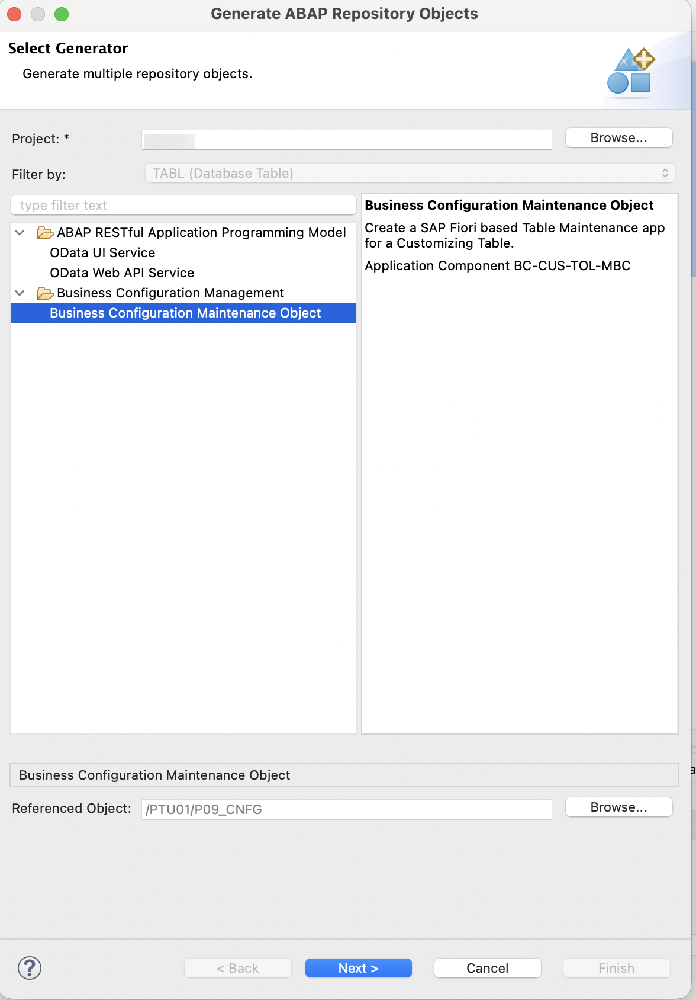

# Exercise 1 — Business Configuration Maintenance Object

This exercise shows you how to create an SAP Fiori based Table Maintenance app using the ABAP RESTful Application Programming Model (RAP) and the Custom Business Configurations (CUBCO) app. This exercise is based on a table which stores the Priority and amount combination that will determine the action to be taken for sales order.

You first create the database tables and then use the ABAP Repository Generator to create the required repository objects.

## Add ABAP Cloud Project to ADT

1. Click on **New** button and choose **ABAP Cloud Project**. Click **Next**.

   

2. Provide your development system URL, e.g. `https://myxxxxxxx.lab.s4hana.cloud.sap`. Click **Next**.

   

3. Click **Open Logon Page in Browser**. The logon page opens in the browser. Enter your user credentials. Once login is successful, you will see this message:

   

4. In ADT, click **Finish**.

   

5. The system is added and visible in the **Project Explorer** section.

6. Expand it by clicking the small arrow beside the system name in **Project Explorer**.

7. Right-click on **Favorite Packages** in the **Project Explorer** section.

8. Choose **Add Package** and provide the software component `/PW#/P##EXT`.

9. Click **OK**.

   

10. Expand it by clicking the small arrow beside the software component `/PW#/P##EXT`. You will see your development package `/PW#/P##_SO_EXT` listed.

## Create Database Artifacts

### Create Domain

1. Right-click Package `/PW#/P##_SO_EXT`. Choose **New → Other ABAP Repository Object** and search for **Domain**.

2. Click **Next**. Provide:
   - **Name:** `/PW#/P##_ACTION`
   - **Description:** P## Action Key

   Click **Next**.

3. Choose the available Transport Request and click **Finish**. Provide the following details:
   - **Data Type:** CHAR
   - **Length:** 3
   - **Output Length:** 3

   | Fixed Value | Description |
   |-------------|-------------|
   | STD         | Standard    |
   | REV         | Review      |
   | MGR         | Manager     |
   | ESC         | Escalation  |
   | CRT         | Critical    |

4. Save and activate.

### Create Data Element (Action Key)

1. Right-click the Package name. Choose **New → Other ABAP Repository Object** and search for **Data Element**.

2. Click **Next**. Provide:
   - **Name:** `/PW#/P##_ACTION`
   - **Description:** P## Action Key

   Click **Next**.

3. Choose the TR and click **Finish**. Provide the following data element details:
   - **Category:** Domain
   - **Type Name:** `/PW#/P##_ACTION`
   - **Field Labels:** enter `Action` for all four labels:

     | Label   | Text   |
     | :------ | :----- |
     | Short   | Action |
     | Medium  | Action |
     | Long    | Action |
     | Heading | Action |

   

4. Save and activate.

### Create Data Element (Amount)

1. Create another data element with the following details:
   - **Name:** `/PW#/P##_AMOUNT`
   - **Description:** P## Amount
   - **Category:** Predefined Type
   - **Data Type:** DEC
   - **Length:** 15
   - **Decimals:** 2
   - **Field Labels:** enter `Amount` for all four labels:

     | Label   | Text   |
     | :------ | :----- |
     | Short   | Amount |
     | Medium  | Amount |
     | Long    | Amount |
     | Heading | Amount |

2. Save and activate.

### Create Database Table

1. Right-click the Package name. Choose **New → Other ABAP Repository Object** and search for and choose **Database Table**.

2. Create a new Table:
   - **Name:** `/PW#/P##_CNFG`
   - **Description:** P## Priority Configuration

   Click **Next**.

3. Choose the TR and Click **Finish**.

4. Replace your code as follows:

   This table stores the configuration rules: each row maps a **Priority** and an **amount range** (`amount_from` to `amount_to`) to an **Action Key**. The event handler you build in Exercise 3 reads this table at runtime to decide which action applies to a Sales Order.

    ```cds
    @EndUserText.label : 'P## Priority Configuration'
    @AbapCatalog.enhancement.category : #NOT_EXTENSIBLE
    @AbapCatalog.tableCategory : #TRANSPARENT
    @AbapCatalog.deliveryClass : #C
    @AbapCatalog.dataMaintenance : #ALLOWED
    define table /pw#/p##_cnfg {

      key client      : abap.clnt not null;
      key priority    : /pw#/p##_priority not null;
      key amount_from : /pw#/p##_amount not null;
      amount_to       : /pw#/p##_amount;
      action_key      : /pw#/p##_action;

    }
    ```

5. Save and activate.

### Create Value Help for Action Field

1. Right-click the Package name. Choose **New → Other ABAP Repository Object** and search for **Data Definition**.

2. Create a new data definition:
   - **Name:** `/PW#/P##_I_Action_VH`
   - **Description:** P## Action Value Help

3. Click **Next** and then click **Finish**.

4. Replace with the following code:

   This CDS view exposes the fixed values of the Action domain as a value help, so the **Action** field offers a dropdown showing each code (STD, REV, …) with its description.

   ```cds
   @AccessControl.authorizationCheck: #NOT_REQUIRED
   @ObjectModel.dataCategory:#VALUE_HELP
   @EndUserText.label: 'Action value help'
   @ObjectModel.resultSet.sizeCategory: #XS
   @Metadata.ignorePropagatedAnnotations: true
   define view entity /PW#/P##_I_Action_VH as select from DDCDS_CUSTOMER_DOMAIN_VALUE_T( p_domain_name : '/PW#/P##_ACTION' )
   {
     @UI.hidden: true
     key domain_name,
     @UI.hidden: true
     @Semantics.language: true
     key language,
     @EndUserText.label: 'Action'
     @ObjectModel.text.element: [ 'text' ]
     key value_low,
     @EndUserText.label: 'Description'
     @Semantics.text: true
     text
   }
   ```

5. Save and activate.

---

## Create Business Configuration Maintenance Object

A Business Configuration Maintenance Object declares a Service Binding as relevant for business configuration. They are listed in the **Custom Business Configurations** app. Selecting an entry in the app renders an SAP Fiori elements-based UI to maintain the business configuration.

ABAP Repository Generator allows you to create the required repository objects, including the RAP business object, service binding and business configuration maintenance object.

1. Right-click the `/PW#/P##_CNFG` table and choose **Generate ABAP Repository Objects…**.

2. Choose **Business Configuration Maintenance Object** and click **Next**.

   

3. Choose your Package `/PW#/P##_SO_EXT` and click **Next**.

4. The system generates a proposal for all input fields based on the description of the table by following these naming conventions. If you receive an error message stating that a specific object already exists, change the corresponding name in the wizard.

   

   Uncheck **Enable Transport Selection Strip** and change **Transport Selection** to **No Transport** as shown in the image above. Click **Next**.

5. The list of repository objects that are generated is displayed. Click **Next**.

   

6. Click **Next** and then click **Finish**.

7. When the generation is complete, the new business configuration maintenance object is displayed.

8. Open the generated Metadata Extension `/PW#/I_P##PRIORITYCONF`. To find it in the **Project Explorer**, expand your package `/PW#/P##_SO_EXT` → **Core Data Services** → **Metadata Extensions** and double-click `/PW#/I_P##PRIORITYCONF`. Then perform the following steps:

   These annotations configure the maintenance UI: they attach value helps to the **Priority** and **Action Key** fields (so users pick from a dropdown) and give the amount fields readable labels.

   1. Add the following code to the `Priority` field to enable value help:

      ```cds
      @Consumption.valueHelpDefinition: [{ entity: {element: 'value_low', name : '/PW#/P##_I_Priority_VH' } }]
      ```

      

   2. Add the following annotation to the `AmountFrom` field:

      ```cds
      @EndUserText.label: 'Amount From'
      ```

   3. Add the following annotation to the `AmountTo` field:

      ```cds
      @EndUserText.label: 'Amount To'
      ```

   4. Add the following code to the `ActionKey` field to enable value help:

      ```cds
      @Consumption.valueHelpDefinition: [{ entity: {element: 'value_low', name : '/PW#/P##_I_Action_VH' } }]
      ```

   5. Save and activate.

9. Publish the Service Binding present under Business Services.

   

---

## Providing Authorization Control for a Business Configuration Maintenance Object

Authorization control in RAP protects your business object from unauthorized access to data.

- To protect data from unauthorized read access, ABAP CDS provides its own authorization concept based on a data control language (DCL).
- Modify operations such as standard operations and actions can be checked against unauthorized access during RAP runtime.
- For this purpose, the generated business object checks the authorization object `S_TABU_NAM` with the CDS entity `/PW#/I_P##PriorityConf` and the activity `03` (read) / `02` (modify).

To consume the service of the generated business object in the CUBCO app, you must define an IAM app and assign the service to the app. This ensures that you can define the required authorizations.

First, you create the IAM app yourself. As a next step, you create a business catalog and a business role that you can assign to your business user.

### Create IAM App

1. Right-click the Package name. Choose **New → Other ABAP Repository Object**.

2. Search for **IAM App**, choose it and click **Next**.

3. Create the IAM App:
   - **Name:** `/PW#/P##_BCM_MAINT`
   - **Description:** P## Priority Maintenance
   - **Application Type:** Business Configuration App

   Click **Next**.

4. Click **Finish**.

5. Click on **Services** tab and add a new service.

   

   - **Service Type:** OData V4
   - **Service Name:** Search for your service binding name.

6. Click on **Authorizations** tab and add a new authorization object.

7. Search and select `S_TABU_NAM`. Click **OK**.

   

8. Choose `S_TABU_NAM`, choose `ACTVT` under Authorization 0001 to check **Change** and **Display**.

   

9. Click `TABLE` and add entity: provide the generated I view name `/PW#/I_P##PRIORITYCONF`.

   

10. Save the IAM App. 

11. Click on Publish Locally button to publish the IAM app. Wait for few minutes until the status changes to 'Published'.

12. The IAM app status shows as `Published` and the `Restriction Type Migration Status` as `Migrated`.

    

---

## Create Business Catalog

1. In the overview section of the IAM App, click **Create a new Business Catalog and assign the App to it**.

   

2. Enter the following and click **Next**:
   - **Name:** `/PW#/P##_BCM_MAINT_BC`
   - **Description:** P## Priority Maintenance

   Click **Next**.

3. Click **Finish**.

4. The wizard for creating a Business Catalog App Assignment opens automatically. Enter the package name. Click **Next**, then click **Finish**.

   

5. In the Business Catalog, click **Publish Locally**. Wait for few minutes until the status changes to 'Published'.

   

---

## Create Business Role Template

A Business Role Template (BRT) is a transportable ABAP object that captures the Business Catalog assignment. Creating a Business Role from a BRT ensures the catalog assignment travels with the transport request rather than requiring manual configuration in each system.

1. In ADT, right-click on Package `/PW#/P##_SO_EXT`. Select **New → Other ABAP Repository Object** and search for **Business Role Template**.

   

2. Click **Next**. Provide:
   - **Name:** `/PW#/P##_BRT_SO_EXT`
   - **Description:** `P## Business Role Template for Sales Order Extension`

   Click **Next**.

   

3. Select the TR and click **Finish**. The Business Role Template editor opens.

4. In the **Business Catalogs** section, click **Add**.

5. A **New B. Role Template Catalog Assignment** dialog opens. Provide **Business Catalog** name: `/PW#/P##_BCM_MAINT_BC`

   

6. Click **Next**, select the TR and click **Finish**.

7. Open and publish the Business Role Template.

---

**Next:** You built the Priority Configuration table and its Custom Business Configurations maintenance app, along with the IAM app, business catalog and Business Role Template that secure it. In [Exercise 2 — Log Table & RAP Object Generation](02_Exercise.md), you'll create the Sales Order Log table and generate its RAP business object and OData UI service.