# Exercise 5 — Deploy an SAP Fiori App Using Business Application Studio

This exercise walks through creating and deploying a SAP Fiori Elements List Report application using SAP Business Application Studio (BAS) and connecting it to the OData V4 service `/PW#/UI_P##_LOG_O4` that was generated in Exercise 2. After deployment, the app is registered as an IAM App, added to a Business Catalog and made accessible via the Fiori Launchpad search.

> **Note:** Replace `##` with your two-digit partner/group number wherever it appears (e.g., `09`). Lowercase form `p##` is used inside BAS / JavaScript namespaces (e.g., `p09`).

---

## Prerequisites

- Access to SAP BTP (Business Technology Platform) cockpit.
- SAP Business Application Studio subscription in BTP. 
- The OData V4 service `/PW#/UI_P##_LOG_O4` from Exercise 2, published and active on your S/4HANA system.
- The gCTS transport request (target `1GT`) you have been using in the previous exercises.
- A BTP destination configured for your S/4HANA system.

> **Note:** Alternatively to SAP Business Application Studio on BTP you can also use the [SAP Fiori Tools Extension in VS Code](../Use_VSCode/SAP_Fiori_Tools_Extension.md) and the command **Fiori: Open Application Generator**

---


## Open Business Application Studio

> **Note:** BAS is accessed via the SAP BTP Cockpit, **not** the S/4HANA Fiori Launchpad.

1. Go to your BTP Cockpit.

2. Click on **Account Explorer**. Navigate to your **Subaccount** → **Instances and Subscriptions**.

   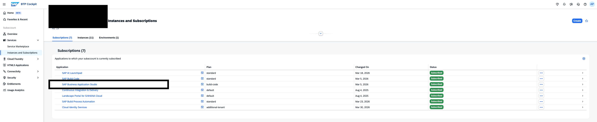

3. Find **SAP Business Application Studio** and click **Go to Application**. You are taken to the **Dev Spaces** page.

   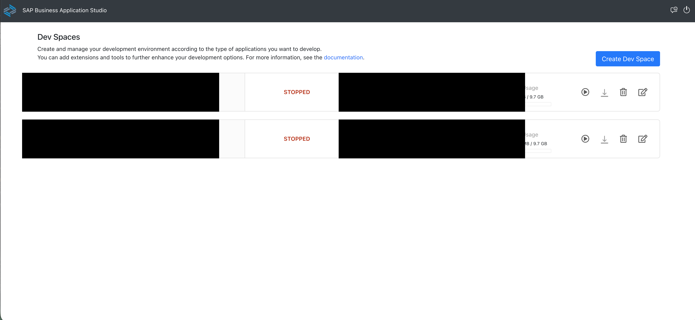

---

## Create or Start a Dev Space

The **Dev Spaces** page lists your existing dev spaces and lets you create new ones.

- **If you already have an SAP Fiori dev space** (type *SAP Fiori*): click the **play button** (▶) next to it to start it, then click the dev space name to open it once it turns green.

- **If you do not have one yet**:

  1. Click **Create Dev Space** in the bottom-right corner.

     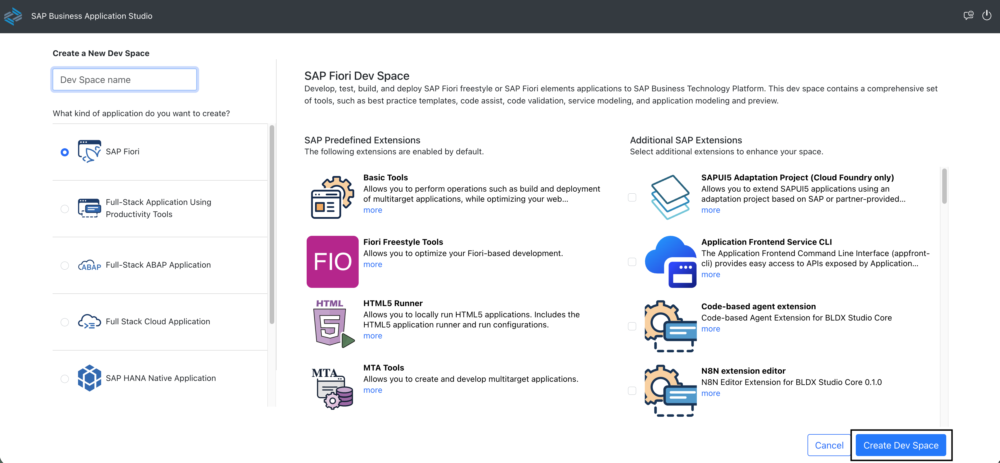

  2. Enter `P##Dev` as the **Dev Space name**.
  3. Select **SAP Fiori** as the kind.
  4. Click **Create Dev Space**.

  The new dev space appears in the list with status **STARTING**.

  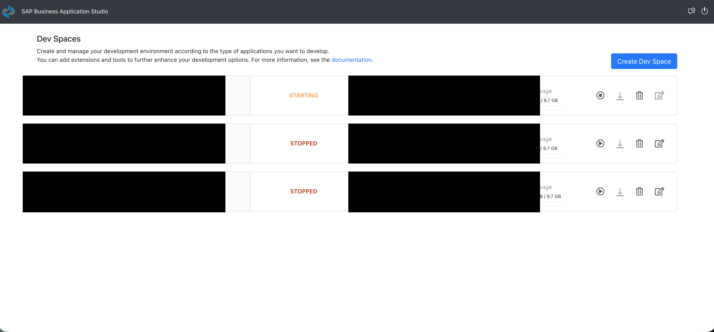

  Once the status turns green (**RUNNING**), click the dev space name to open it.

Opening the dev space launches **Business Application Studio** (the IDE) in a new browser tab.

---

## Generate the Fiori App

Once BAS opens:

1. Open **File → Open Folder...**.

   

2. Select the **projects** folder in the popup and click **OK**. The `projects` folder opens and is visible in the **EXPLORER**.

   

3. Press `Ctrl+Shift+P` (or `Cmd+Shift+P` on macOS) to open the **Command Palette**, type **Fiori: Open Application Generator** and select it.

   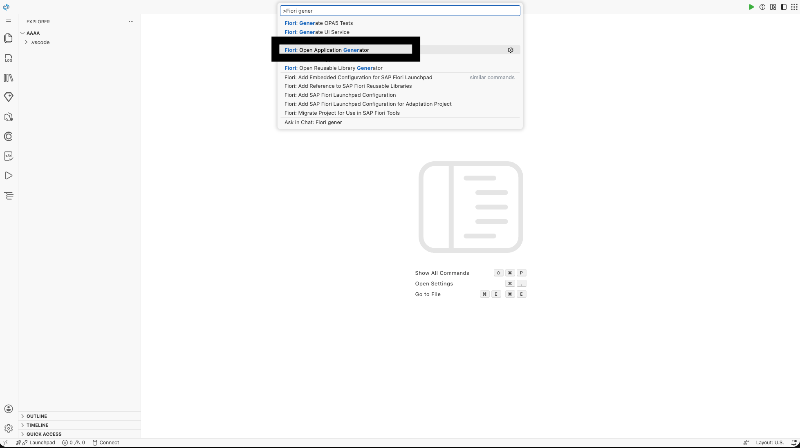

### Step 1 — Template Selection

Choose **List Report Page**.

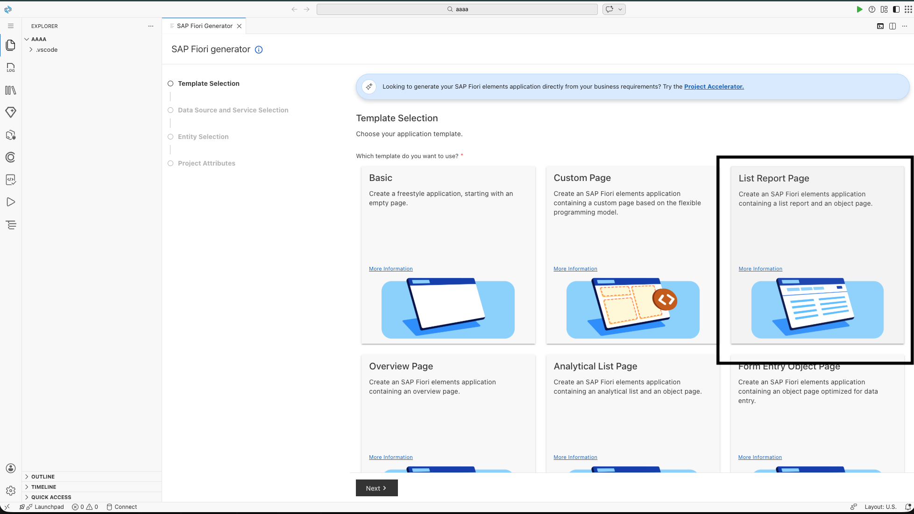

Click **Next**.

### Step 2 — Data Source and Service Selection

- **Data Source:** `Connect to a System`
- **System:** Your S/4HANA destination.
- **Service:** Once the system connects, choose `/PW#/UI_P##_LOG_O4` (OData V4).
- A prompt will appear: **The service contains references to value help services. Do you want to download the associated metadata during generation?** — leave it set to **Yes**.


Click **Next**.

### Step 3 — Entity Selection

- **Main Entity:** Select the root entity exposed by the service (e.g. `P##_LOG`).
- **Automatically add table columns / section:** **Yes**
- **Table Type:** **Responsive**

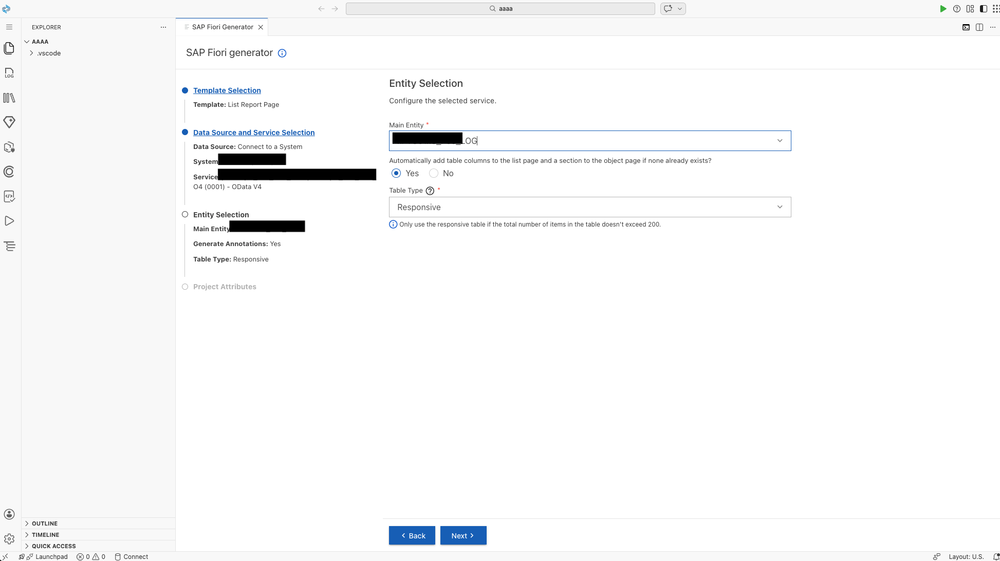

Click **Next**.

### Step 4 — Project Attributes

Fill in:

| Field | Value |
|-------|-------|
| Module Name | `p##-audit-log` |
| Application Title | `P## Sales Order Audit Log` |
| Application Namespace | `com.pw#` |
| Description | `P## Sales Order Audit Log` |
| Project Folder Path | (keep default) |
| Minimum SAPUI5 Version | (keep default — e.g. `Source system version`) |
| Enable TypeScript | **No** |
| Add Deployment Configuration | **Yes** |
| Add SAP Fiori Launchpad Configuration | **Yes** |
| Use Virtual Endpoints for Local Preview | **Yes** |
| Configure Advanced Options | **No** |

> **Note:** Set **Add Deployment Configuration** and **Add SAP Fiori Launchpad Configuration** to **Yes**. The wizard then adds two more steps — **Deployment Configuration** and **SAP Fiori Launchpad Configuration** — which generate `ui5-deploy.yaml` and the cross-navigation inbound in `manifest.json` for you.

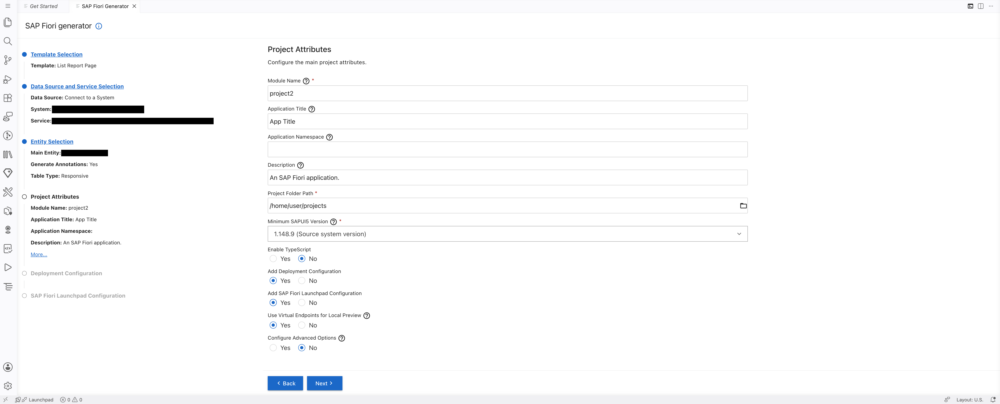

Click **Next**.

### Step 5 — Deployment Configuration

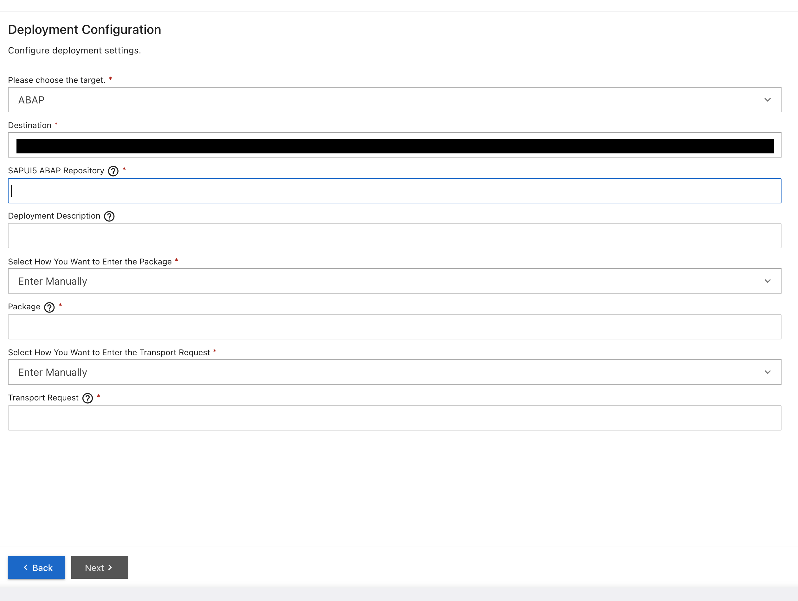

Fill in the deployment target:

| Field | Value |
|-------|-------|
| Please choose the target. | `ABAP` |
| Destination | Your BTP destination (e.g. `<YOUR_DESTINATION> (S4HC)`) |
| SAPUI5 ABAP Repository | `/PW#/P##AUDITLOG` |
| Deployment Description | `P## Audit Log App` |
| Select How You Want to Enter the Package | `Enter Manually` |
| Package | `/PW#/P##_SO_EXT` |
| Select How You Want to Enter the Transport Request | `Enter Manually` |
| Transport Request | Your gCTS transport number from the previous exercises (e.g. `<SID>K9xxxxx`) |

> **Notes:**
> - **SAPUI5 ABAP Repository** (the app name) must include the namespace prefix `/PW#/` — e.g. `/PW#/P##AUDITLOG`.
> - **Transport Request** must be a gCTS transport with target `1GT` — the same request you used in the previous exercises.
> - To find your transport request number, open the **Transport Organizer** tab in the bottom panel of ADT and expand **Workbench → 1GT → /PW#/P##EXT → Modifiable** — your request (e.g. `<SID>K9xxxxx`) is listed there.

Click **Next**.

### Step 6 — SAP Fiori Launchpad Configuration

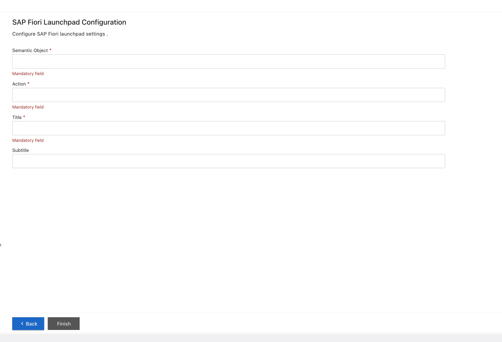

These values become the cross-navigation inbound (the LADI) that lets the app be added to a Business Catalog as a tile.

| Field | Value |
|-------|-------|
| Semantic Object | `P##AuditLog` |
| Action | `display` |
| Title | `P## Sales Order Audit Log` |
| Subtitle (optional) | `Audit log of sales order changes` |

> **Notes:**
> - The **semantic object + action** pair (e.g. `P##AuditLog-display`) must be unique within the launchpad. Use your partner prefix to avoid collisions.
> - This generates the `crossNavigation` inbound in `webapp/manifest.json` automatically. Without it, the app is reachable by direct URL but **cannot be added to a Business Catalog as a tile** — the deploy log would warn `No LADI was created as no inbound is defined in manifest.json`.

Click **Finish**. BAS generates the project.

When generation completes, BAS shows a prompt because the new project is not yet part of the current workspace:

> *The project '/home/user/projects/project2' is not in the current workspace. Some SAP Fiori tools features won't work. What do you want to do?*

Click **Open Folder** to reopen BAS with the generated project as the workspace root (recommended). Alternatively, click **Add Project to Workspace** to keep your current workspace and add the project to it. Do **not** click **Cancel** — the SAP Fiori tools features (deploy tasks, guided development, etc.) only work when the project is in the workspace.

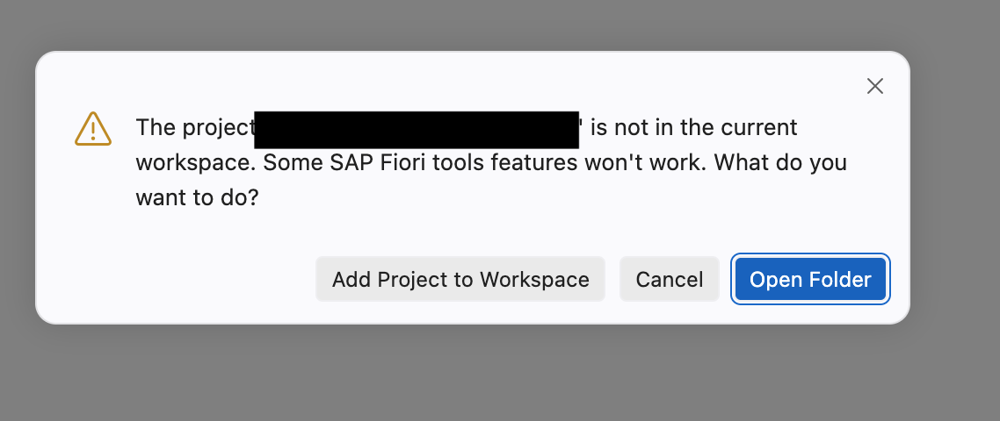

---

## Add Translatable App Titles

Add the below translatable texts in `webapp/i18n/i18n.properties` and save the file.

   ```properties
   flpTitle=P## Sales Order Audit Log
   flpSubtitle=Audit log of sales order changes
   ```

   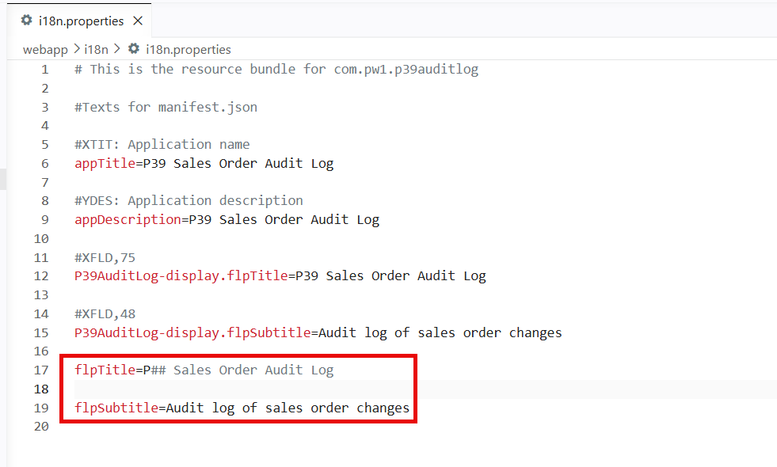

---

## Build and Deploy to S/4HANA

The wizard already generated the deployment configuration (`ui5-deploy.yaml`) and the Fiori Launchpad inbound in `manifest.json`, so no separate `deploy-config` command or manual `manifest.json` edit is needed. Open a terminal inside the project root (`Terminal → New Terminal` in BAS) and run the following commands in order:

1. **Install dependencies** — fetches all packages declared in `package.json` (`@sap/ui5-tooling-modules`, `@sap-ux/ui5-deploy`, etc.):

   ```bash
   npm install
   ```

2. **Build the app** — runs `ui5 build` and produces the deployable `dist/` folder with cache-buster metadata:

   ```bash
   npm run build
   ```

3. **Deploy to S/4HANA** — invokes the `deploy-to-abap` custom task configured in `ui5-deploy.yaml`:

   ```bash
   npm run deploy
   ```

   Confirm with `Y` when prompted. A successful deployment shows:

   ```
   Launchpad App Descriptor Item /PW#/P##AUDITLOG_UI5R was created
   Deployment Successful.
   App available at https://<your-system>.s4hana.cloud.sap/sap/bc/ui5_ui5/pw#/p##auditlog
   ```

   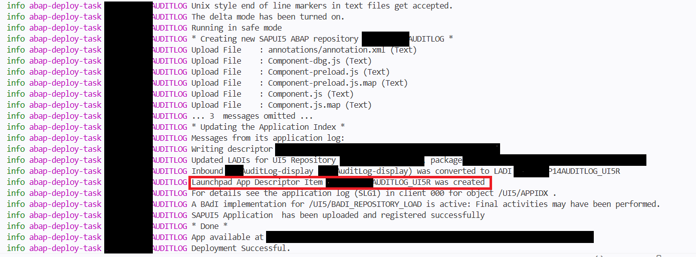

4. Note the **Launchpad App Descriptor Item ID** (`/PW#/P##AUDITLOG_UI5R`) — you need it in the next step.

> **Tip:** Re-running `npm run deploy` after subsequent code changes will update the same app, as long as the same `transport` and `app.name` are kept in `ui5-deploy.yaml`. If you change the transport (e.g. the previous one was released), update the YAML before re-deploying.

---

## Create IAM App in ADT

1. In ADT, right-click on Package `/PW#/P##_SO_EXT`. Select **New → Other ABAP Repository Object** and search for **IAM App**.

   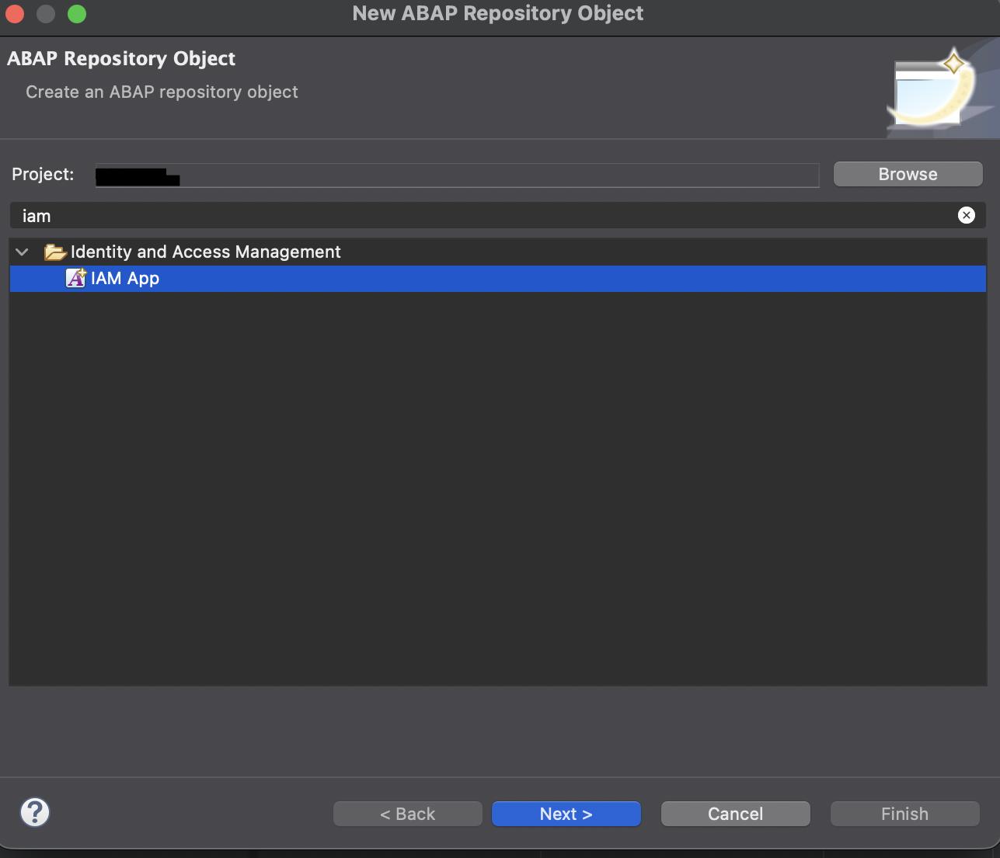

2. Click **Next**. Provide:
   - **Name:** `/PW#/P##_AUDIT_LOG_APP`
   - **Description:** P## Audit Log Fiori App
   - **Application Type:** EXT-External App

   > **Important:** Use Application Type **EXT-External App** — not "Fiori App" or "UI Adaptation App". The `UI5R` descriptor item created during BAS deployment is only compatible with the External App type.

   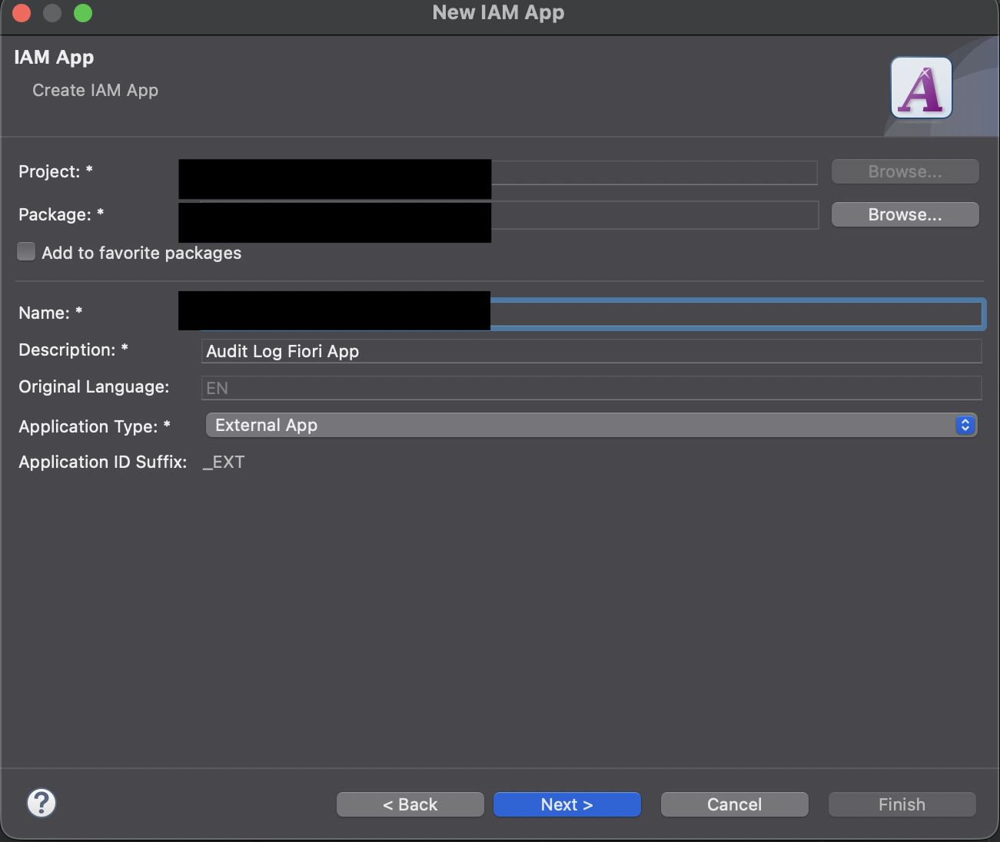

3. Select the TR and click **Finish**.

   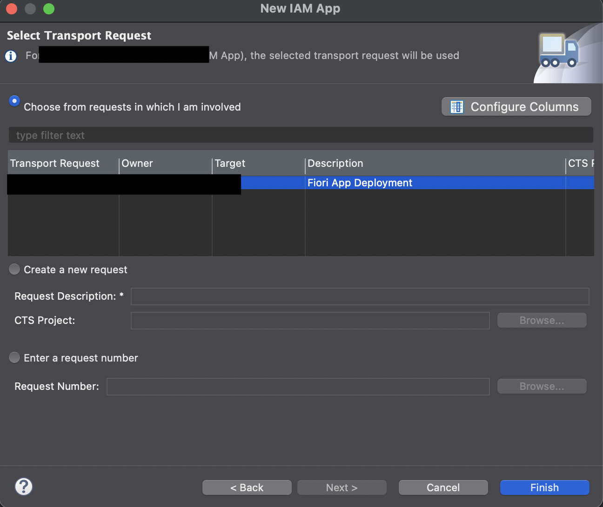

4. In the **General** section of the **Overview** tab of the IAM app, enter:
   - **Fiori Launchpad App Descr ID:** `/PW#/P##AUDITLOG_UI5R` (from the previous step or you can also find it in the **Project Explorer**, expand your package `/PW#/P##_SO_EXT` → **Fiori User Interface** → **Launchpad App Descriptor Items**.)

5. Click **Publish Locally**.

   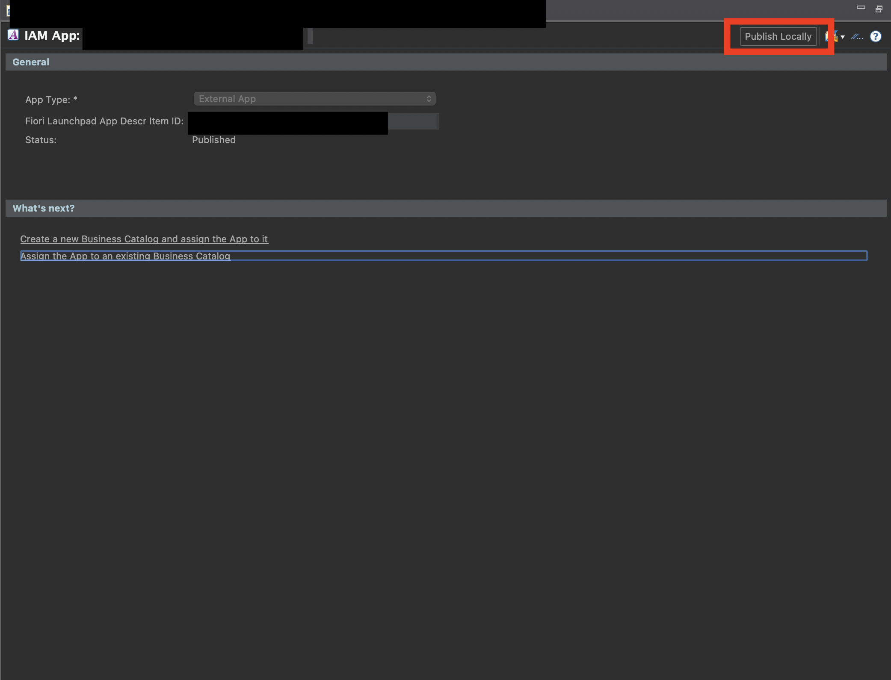

---

## Create Business Catalog

The Business Catalog is the container that groups one or more IAM Apps so they can be assigned to a Business Role and surfaced as tiles in the Fiori Launchpad.

1. Open IAM app '/PW#/P##_AUDIT_LOG_APP_EXT'. In the overview section of the IAM App, click **Create a new Business Catalog and assign the App to it**.

2. Enter the following details:
   - **Name:** `/PW#/P##_AUDIT_LOG_BC`
   - **Description:** P## Audit Log Business Catalog

   Click **Next**.

3. Click **Finish**.

4. The wizard for creating a Business Catalog App Assignment opens automatically. Provide package name '/PW#/P##_SO_EXT'.

5. Click **Next** and then click **Finish**.

6. Open Business Catalog '/PW#/P##_AUDIT_LOG_BC', click **Publish Locally**. Wait for a few minutes until the status changes to 'Published'.

---

## Assign Business Catalog to the Business Role Template

1. Open Business Role Template '/PW#/P##_BRT_SO_EXT' created in Exercise 1. It is present in your package in 'Identity and Access Management' section.

2. Click **Add** and provide Business Catalog name: `/PW#/P##_AUDIT_LOG_BC`.

   

3. Click **Next**.

4. Select the Transport and click **Finish**.

---

## Create Business Role from Template

1. Launch the SAP Fiori Launchpad and open the **Maintain Business Roles** app.

2. In the Business Roles list toolbar, click **Create From Template**.

3. In the dialog, the **Template** field is searchable — enter `/PW#/P##_BRT_SO_EXT` and select it. The system auto-fills the **New Business Role ID** from the BRT name — clear it and enter:
   - **New Business Role ID:** `PW#_P##_BR_SO_EXT`
   - **New Business Role Description:** `P## Business Role for Sales Order Extension`
   - Keep **Activate IAM Apps** checked.

   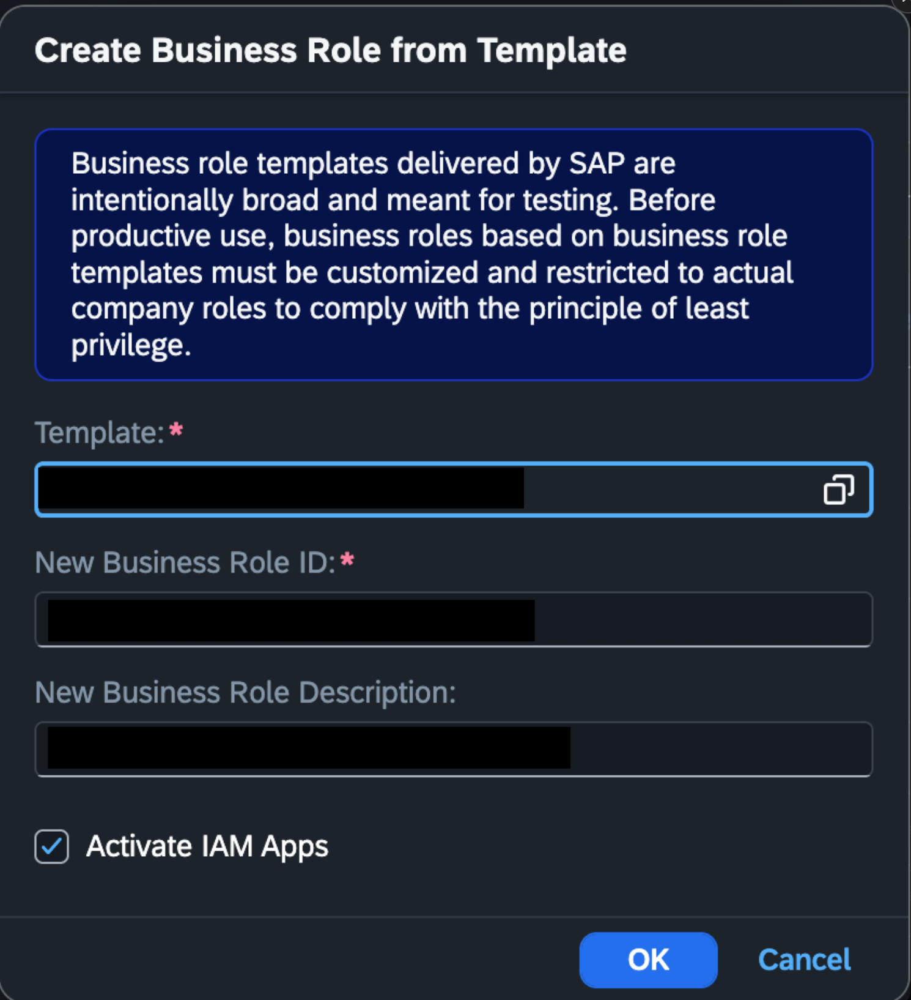

4. Click **OK**. The new Business Role opens in edit mode. The Business Catalog is already assigned (inherited from the BRT).

5. Change access categories to **Unrestricted**.

   

6. Go to the **Business Users** tab and add your user.

   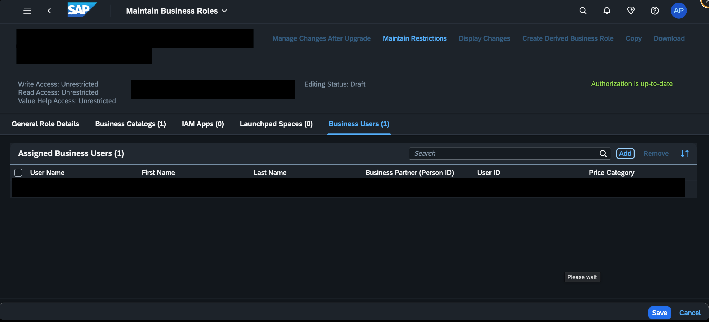

7. Click **Save**.

---

## Access the App

The app is accessible via the Fiori Launchpad search — no manual tile or space configuration is required.

1. Refresh the Fiori Launchpad: `Ctrl+Shift+R` (or `Cmd+Shift+R` on macOS).

2. Click the **Search** icon in the top bar and type `P## Sales Order Audit Log`.

3. The app appears in the search results. Click it to open.

   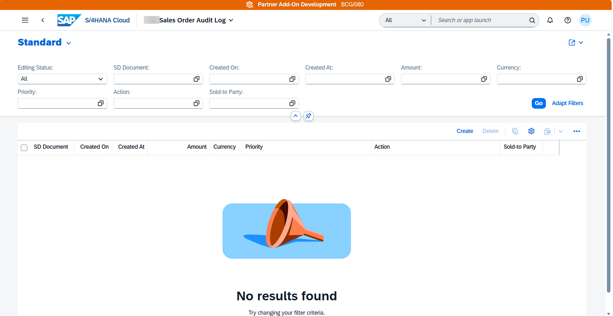

---

## Troubleshooting

| Error | Cause | Fix |
|-------|-------|-----|
| `403 Forbidden` when accessing direct URL | UCON security blocks direct BSP access | Access via the Fiori Launchpad search only |
| `Customer object WAPA cannot be assigned to package` | App name `Z*` can't go in a namespaced package | Use a namespaced app name, e.g. `/PW#/P##AUDITLOG` |
| `Request does not have transport target 1GT` | Wrong transport type | Use a gCTS transport (target `1GT`) |
| `UI5R can only be used in Adaptation UI Apps` | Wrong IAM App type | Create the IAM App with type **External App**, not Fiori App or UI Adaptation App |
| App not found in Fiori search | Catalog not published, not assigned to role, or role not assigned to user | 1) Publish `/PW#/P##_AUDIT_LOG_BC` in ADT. 2) Verify the BRT has the catalog and is published. 3) Verify `PW#_P##_BR_SO_EXT` exists and your user is in the **Business Users** tab. 4) Reload the Fiori Launchpad (`Ctrl+Shift+R`, or `Cmd+Shift+R` on macOS). |
| **Create From Template** shows no BRT in the list | BRT is not yet published | Open the BRT in ADT and click **Publish Locally**, then retry. |
