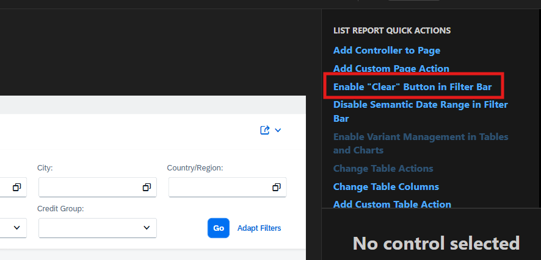
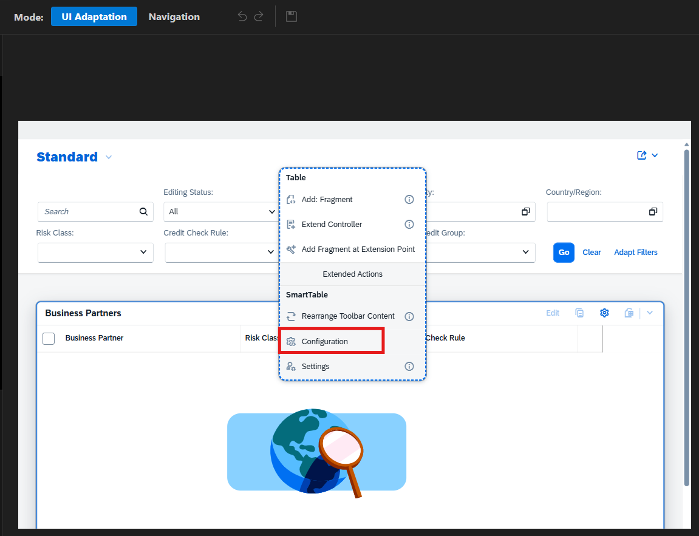
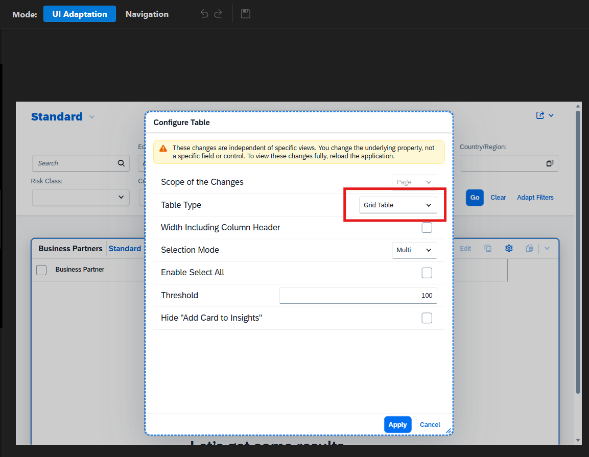
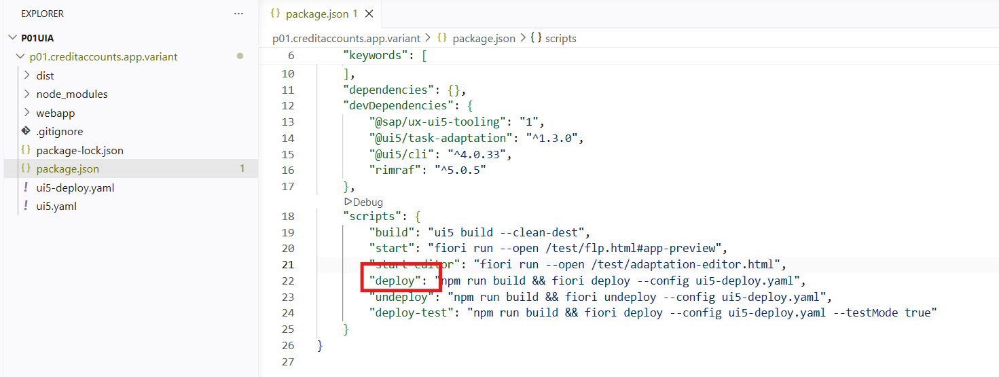

# Exercise 6 — SAPUI5 Adaptation (Optional)

This exercise shows you how to work with SAPUI5 Adaptation Projects to extend a standard SAP Fiori application by generating an application variant and making simple changes to the variant in SAP S/4HANA Cloud Public Edition.

## Create a new TR for saving the UI5 Adaptation changes.

1. Open ADT and click **Transport Organizer** tab in the bottom window.

2. In the **Transport Organizer** tab, expand your system and follow path **Workbench->1GT->/PW#/P##EXT**.

3. Right click on the package and click **New Transport Request**.

4. In the popup in **Short Description** field provide `P## UI Adaptation` and Click `Finish`.

## Create package 

Create a package to save the development objects of this exercise.

1. From the list of Favorite Packages in Project Explorer, right-click on the package `/PW#/P##EXT` and choose **New → ABAP Package**.

2. Provide:
   - **Package Name:** `/PW#/P##_UI_ADT`
   - **Description:** P## UI Adaptation

   Click **Next**. Click **Next** again.

3. Choose the option **Choose from requests in which I am involved**. Choose the transport request created above and click **Finish**.

## Create UI Adaptation project
> **Note:** Alternatively to SAP Business Application Studio on BTP you can also use the [SAP Fiori Tools Extension in VS Code](../Use_VSCode/SAP_Fiori_Tools_Extension.md) and the command **Fiori: Open Adaptation Project Generator**

1. Log on to SAP Business Application Studio (BAS) and access your SAP Fiori development space.

> **Note:** Please refer [Open Business Application Studio](05_Exercise.md#open-business-application-studio) for steps to access SAP Business Application Studio(BAS).

2. Create a new folder P##UIA in the path /home/user/projects/.
   - Open **File->Open Folder...**.
     
   - Open projects folder by selecting **projects** in the popup and click **OK**.
     
   - Projects folder will be opened and will be visible in the EXPLORER.
   - In the EXPLORER, click **New Folder** icon, provide the folder name as P##UIA.
     

3. Choose **New Project from Template** (select from the **File** menu, or directly on the **Get Started** screen), select **SAPUI5 Adaptation Project** template and choose **Start**.

> **Note:** Please do not select the template **(Legacy) SAPUI5 Adaptation Project**.

> **Note:** If you get the below screen to choose the **Target Environment**, select `ABAP`.

> 

4. On the **System and Application Selection** screen, select the destination having your system name from the **System** dropdown list.

> **Note:** If you get the error **You have selected a system that does not support Classic adaptation projects. Please select a supported system**, follow the below steps to resolve the error.
> 1. Click **Manage(gear icon)**, present at left bottom, then click **Settings**.

> 

> 2. In the popup window, type **Internal** and uncheck **Enable internal features** under **SAP > Ux > Internal: Enable Internal Features** in the both tabs, **User** and **Remote**.

> 

> 3. Select the destination again from the **System** dropdown list. If it still shows an error, reload BAS and try again.

5. From the dropdown list in the **Application**, choose `Manage Credit Accounts` as the basis for the application variant.

> 

6. Press **Next**.

7. On the Project Attributes screen, enter the basic information required for the adaptation project:
    - **Project Name**: p##.creditaccounts.app.variant
    - **Application Title**: `Manage Credit Accounts Simplified P##`
    - **Namespace**: Will be generated from the project name.
    - **Project Folder Path**: Under /home/user/projects/P##UIA
    - **Add Deployment Configuration**: Yes
    - **Add SAP Fiori Launchpad Configuration**: Yes
    - Retain the remaining values

> 

8. Press **Next**.

9. Configure the Deployment Configuration settings.
    - **SAPUI5 ABAP Repository**: /PW#/P##MCA 
    - **Enter an optional deployment description** - P## Manage Credit Accounts Simplified
    - Choose `Enter Manually` for the field **Select How You Want to Enter the Package**.
    - Enter `/PW#/P##_UI_ADT` in the **Package field**.
    - Choose `Enter Manually` for the field **Select How You Want to Enter the Transport Request**.
    - Provide the transport request created at the start of the exercise in the **Transport Request** field.

> 

10. Press **Next**.

11. Configure the SAP Fiori Launchpad Configuration – Tile Handling
    - Choose `Add Tile` for the field Choose a **Tile Handling Action**.
    - Choose `Yes` for the field **Copy Configurations from an Existing Inbound?**

12. Press **Next**.

13. Configure the **SAP Fiori Launchpad Configuration: Tile Settings**.
    - In the **Inbound ID** field, select the inbound ID from the dropdown list `BusinessPartner-manageCreditAccounts`.
    - In the **Semantic Object** field, enter the name of the semantic object of the original application, that is `BusinessPartner`.
    - In the **Action** field, enter a unique new action `p##ManageCreditAccounts` in camel case.
    - In the **Title** field, enter the title of your application variant of Manage Credit Accounts that is to be displayed on the new tile `P## Manage Credit Accounts Simplified`.
    - In the **Subtitle** field (optional), you can enter the subtitle to be displayed on the new tile `P## Simplified`.
    - Retain the remaining values.

> 

14. To create your new SAPUI5 Adaptation Project, press **Finish**.

15. As soon as your SAPUI5 Adaptation Project has been created, the **Application Information page** is displayed. You can view the adaptation project in the folder **P##UIA** and expand the nodes in your workspace.

## Open Adaptation Editor

To make the requested changes to the standard app, you need to extend the source code of your application variant in SAP Business Application Studio. In your workspace, navigate to the newly created SAPUI5 Adaptation Project under **P##UIA**. Open the **webapp** folder, right-click on the **manifest.appdescr_variant** file in your adaptation project and choose Open Adaptation Editor. Wait for few minutes until the Manage Credit Accounts app is loaded in the Adaptation Editor.

## Add a Clear button to the smart filter bar

1. **Quick Actions**
   - In **UI Adaptation** mode, choose  the action **Enable “Clear” Button in Filter Bar** from **List Report Page Quick Actions** situated at the top right of the Adaptation Editor. 

   

   - Save your changes.

2. In BAS, in your project workspace, the propertyChange you have just made is listed in the webapp folder under changes.

3. After doing the changes a **clear** button will be visible in the smart filter bar.

   

## Enable variant management for the table

1. Quick Actions
   - In **UI Adaptation** mode, choose the action **Enable Variant Management in Tables and Charts** from **List Report Page Quick Actions** .
   - Save your changes.

2. After doing the changes the variant name **Standard** will be visible above the Table.

   

## Change table type from Responsive Table to Grid Table with condensed table layout

1. In **UI Adaptation** mode, select the Table and choose **Configuration** from the context menu.

2. In the **Configure Table** popup, select the value `Grid Table` for **Table Type** and choose **Apply**.

3. Save your changes.

## Remove header facets

1. In the Adaptation Editor, switch to the **Navigation mode** and press the **Go** button to display Business Partner data in the table.

2. Select a **Business Partner** in the table by pressing the chevron icon at the end of the row. By selecting a **Business Partner**, you can navigate from the List Report to the Object Page.

3. On the Object Page, switch to **UI Adaptation mode**. Select the header facet you want to remove, for example `Scoring Trend`(The whole facet should be selected).

4. To remove a header facet from the Object Page, select the entire facet (not just its title), right click to open the context menu and select `Remove`.

5. Save your changes.

## Remove tabulated sections

1. In **UI Adaptation mode** on the object page, select the tab name you want to remove from your application variant (for example External Ratings). Afterwards, right click to open the context menu and select `Remove`.

2. Change to Navigation mode and verify the changes you’ve made, **External Ratings** tab will not be displayed.

3. Save your changes.

## Make Your Application Variant available to Business Users

### Build and deploy your new application variant

1. To build and deploy your application variant in **SAP Business Application Studio**, you can:
   - Run the script **npm run deploy** in the Terminal(Right click on folder p##.creditaccounts.app.variant and click on **Open in Integrated Terminal** to view the terminal), 
   OR
   - Double-click the package.json to open the file. Under “scripts”, hover your cursor over "deploy” and select `Run Script`.

    

2. You can track the progress of the build process in the Terminal. After the application variant has been built, you are prompted to provide confirmation that the application is to be deployed. In response to Start deployment (Y/n)? confirm yes by typing **Y** after verifying the details.

3. After successful deployment of your application variant, a confirmation message is displayed.

> **Note:** Deployment may fail couple of times — keep retrying and it will eventually succeed.

> For more information, see [Deploy or Update the Adaptation Project to the ABAP Repository](https://help.sap.com/docs/bas/584e0bcbfd4a4aff91c815cefa0bce2d/b8feaf8e337d4ef7ad9069bbf6016689.html?locale=en-US&state=PRODUCTION&version=Cloud).

### Create IAM artifacts required for SAP Fiori launchpad configuration in ABAP Development Tools

1. Open and log onto ABAP Development Tools (ADT).

2. In the Project Explorer, open your package `/PW#/P##_UI_ADT` and expand the **BSP Library** folder and then the **BSP Applications** folder to view the application variant you deployed in SAP Business Application Studio.

3. In the same package, you will find the folder **Fiori User Interface** containing the **FLP App Descriptor Items** folder. The FLP App Descriptor item with the name **<BSP application name>_UI5R** was generated automatically when you deployed the application variant in SAP Business Application Studio.

4. Right-click on your package `/PW#/P##_UI_ADT` and choose **New –> Other ABAP Repository Object**.

5. In the ABAP Repository Object dialog box, search for IAM and select **IAM App** under the folder **Identity and Access Management**.

6. Choose **Next**.

7. In the New IAM App dialog box, enter the package `/PW#/P##_UI_ADT`, name and description
   **Name**: Enter `/PW#/P##MCAIAM`.
   **Description**: P## Manage Credit Accounts Simplified.

8. In the **Application Type** field, select `UI Adaptation App`. The **Application ID Suffix** _UI5A is set automatically.

9. Choose **Next**.

10. In the **Select Transport Request** dialog box, choose your transport request and choose **Finish**.

11. In your package `/PW#/P##_UI_ADT`, expand the folder **Identity and Access Management –> IAM Apps** and you will see your newly created IAM app with the name you specified in step 7 and the suffix UI5A.

12. Open your newly created **IAM App** in the **IAM Apps folder**. On the Overview tab, enter the **Fiori Launchpad App Descriptor Item ID** that was generated automatically in your **Fiori User Interface folder –> Launchpad App Descriptor Items** with the name **<BSP application name>_UI5R**.

13. Open the **Services** tab, which will now list the services used by your application variant. Choose **Synchronize**.

> **Note:** The IAM app may display errors as shown in the snapshot below. These are not blocking errors, so you can proceed with next step. These errors occur because the IAM app does not automatically inherit all authorization values from the standard application's IAM app. The solution is to manually copy the missing authorization values from the standard IAM app into your newly created IAM app. 

> 

14. You need to publish your IAM app locally, to do this choose the **Publish Locally** button on the top right of the screen.

### Create a new Business Catalog and assign the app to it

1. In the IAM App Overview see **What’s next?** and select the link **Create a new Business Catalog and assign the App to it**, which opens the New Business Catalog dialog box.

2. The **Project name** and **Package name** fields are automatically filled.

3. Enter the name and description
   **Name**: Enter `/PW#/P##_CAT_MCA`.
   **Description**: P## Business Catalog for Manage Credit Accounts Simplified.

4. Choose **Next**.

5. Select your transport request and choose **Finish**.

6. The **Business Catalog IAM App Assignment** dialog box is displayed.In the **Package** field, browse and select your package `/PW#/P##_UI_ADT`.

7. Check the **assignment name** and **description**. Add **P##** at the start of the description and choose **Next**.

8. Select your transport request and choose **Finish** to create the Business Catalog App Assignment.

9. You can see your newly created Business Catalog in the folder **Business Catalogs**. Open the Business Catalog you created and select the **Apps** tab to confirm your app **Assignment ID** and **App ID**.

10. Choose the **Publish Locally** button at top right of your screen to publish the newly created Business Catalog.

### Create a Business Role Template and add the business catalog to it

1. Right-click on your package `/PW#/P##_UI_ADT` and choose **New --> Other ABAP Repository Object**.

2. In the ABAP Repository Object dialog box, search for **Business Role** and select **Business Role Template** under **Identity and Access Management** folder.

3. Choose **Next**.

4. In the **Business Role Template** dialog box, enter the name and description
   **Name**: Enter `/PW#/P##_BRT_MCA`.
   **Description**: P## Business Role Temp for Manage Credit Accounts Simplified.

5. Choose **Next** and select your transport request.

6. Choose **Finish**.

7. In the **Business Role Template**, choose `Add` to add your newly created Business Catalog `/PW#/P##_CAT_MCA`.

8. In the **Business Role Template Catalog Assignment** dialog box, enter the name of your Business Catalog in the Business Catalog field. The name of the Business Role Template is automatically populated.

9. Choose **Next** and select your transport request.

10. Choose **Finish**.

11. The **Business Role Template Catalog Assignment** is displayed with the **Assignment ID**, **Business Role Template ID** and **Business Catalog ID**.

12. In the **Identity and Access Management** folder, expand the **Business Role Templates** folder and open your Business Role Template. Choose **Publish Locally**.

### Configure SAP Fiori launchpad

To ensure the new application variant can be made available on **SAP Fiori launchpad->My Home**, you must perform the following steps:

1. Open the **SAP Fiori launchpad** in your SAP S/4HANA Cloud Public Edition system and then Open the **Maintain Business Roles** app.

2. Create a business role using your newly created role template.

3. Choose **Create from Template** and in the popup window **Create Business Role from Template**, press `F4 help` and choose your role template.

4. Keep the prefilled name and add P## at the start of the description and choose OK.

5. Your **business role** is displayed. Open the Business Catalogs tab and check the business catalog you created earlier is listed.

6. Open the **Business Users** tab and choose **EDIT** and then `Add.`

7. Enter your `First Name` and `Last Name` and select your business user. Choose OK. Save your changes.

### Access your new application variant

1. Open SAP Fiori launchpad of your SAP S/4HANA Cloud Public Edition system.

2. Open **Home** in SAP Fiori Launchpad.

3. Click on your **profile** and click on **App Finder**.

4. Search for **Manage Credit Account**.

5. Click on `+` icon (Add tile) on your app (P## Manage Credit Accounts Simplified).

6. Select **My Home** in the popup and click on **OK**.

### Test your new app

1. Go to **Home** and scroll down to the **Apps** section and click on the **Favorites** tab.

2. Your app is visible in the **Favorites** tab. Click on the tile to open the app.

3. In the filters, add some values and then click **Clear** to remove all the values in the filter bar.

4. Click **Settings(gear icon)** above the list report table. In the popup, uncheck a few fields and check a few new fields and click **OK**.

5. Click the dropdown for variant selection and click **Save As**.

6. Change the **View** name from `Standard` to `My View` and click **Save**.

7. Now, in the dropdown for variant selection you can select **My View** to view the customized layout.

8. Click **Go** without any filters to view all the entries in list report table. The values are shown in Grid Table instead of Responsive Table as in the original app.

9. Select a **Business Partner** in the table by pressing the chevron icon at the end of the row. By selecting a **Business Partner**, you can navigate from the List Report to the Object Page.

10. In the object page, the removed sections - `Scoring Trend` in the Header Facet and the tab `External Ratings` will not be visible.

> **Note:** Do not release the transport request created for this exercise.

