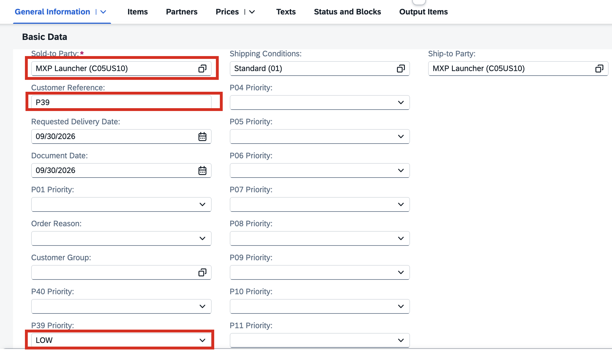
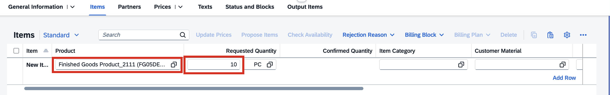
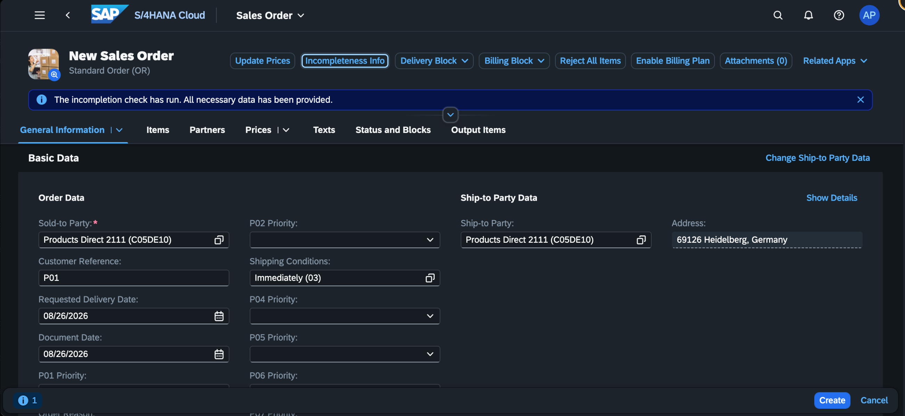
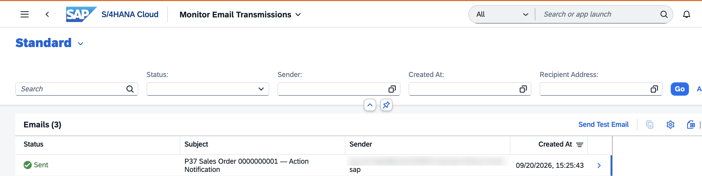

# Exercise 7 — End-to-End Scenario Test

## Step 1 — Maintain the Business Configuration

Before creating a Sales Order, confirm that priority/amount/action rules are present in the configuration table. These rules determine which action is applied by the event handler.

### Use the Custom Business Configurations App

The **Custom Business Configurations** app serves as an entry point to the configuration objects provided by different applications or partners. You can use the app to adjust these configuration objects to change and influence the system behavior.

1. Launch SAP Fiori Launchpad.

2. Log on with your user.

3. Choose the **Custom Business Configurations** tile. If you cannot find the tile, try to search for **Custom Business Configurations** or use the app finder.

4. Choose your business configuration.

5. Click **Edit** and enter data as shown below:

   

   Click **Save**.

---

## Step 2 — Create a Sales Order with Priority

1. In the Fiori Launchpad, open the **Manage Sales Orders - Version 2** app.

2. Click **Create** to open a new Sales Order.

3. In the Create dialog, fill in the required fields and click Continue:
   - **Sales Order Type**: select `Standard Order (OR)` from the dropdown
   - **Sales Organization**: select `US10`.
   - The rest of the fields are optional.

4. On the Sales Order form, fill in the mandatory header fields:
   - **Sold-to Party:** Select `MXP Launcher`
   - **Customer Reference:** any reference value (e.g. your partner number `P##`)
   - **Priority** - Locate the **Priority** field (P## Priority) and set it to `Low`

   

   > **Tip:** If you are unsure which fields are still missing, click the **Incompleteness Info** button in the toolbar — it lists all mandatory fields that still need a value.

5. In the `Items` section, enter the values below:
   - Choose **Product** - `Finished Goods Product_2111 (FG05DE10)`.
   - Enter **Requested Quantity** as `10`.

   

   > **Important:** Before saving, click **Incompleteness Info** in the toolbar and confirm all mandatory fields are complete. The event handler only fires when all mandatory fields are filled in. If any field is still missing, the handler will not trigger.

   

6. Click **Save**. Note the Sales Order number (e.g., `10` or `0000000010`).

---

## Step 3 — Verify the Log Entry in the Audit Log App

1. Click the **Search** icon in the Fiori Launchpad top bar, type `P## Sales Order Audit Log` and open the app from the search results.

2. In the List Report, the filter bar pre-loads with no values. Click **Go** (or **Search**) to load all log entries.

3. Locate the row for your Sales Order number. Confirm the following columns match your expectations:

   | Column | Expected value |
   |--------|----------------|
   | SD Document | Your sales order number |
   | Created On | Today's date |
   | Amount | The net amount of the Sales Order |
   | Currency | The transaction currency (e.g. `USD`) |
   | Priority | The priority you set (e.g. `Low`) |
   | Action | The action resolved from the config table (e.g. `Standard`) |
   | Sold-to Party | The sold-to party number you entered |

4. If no entry is visible, reload the app and search again — the event handler runs asynchronously after the Sales Order save and may need a few seconds to commit.

   > **Tip:** Use the **SD Document** filter field to search by your exact order number.

---

## Step 4 — Verify the Delivery Block (for ESCALATION and CRITICAL Actions) / Test Sales Order Update

The event handler also listens to the Changed (on_updated) event. Test this by modifying the Sales Order. If the Priority and Amount combination resolved to action **ESCALATION** or **CRITICAL**, the event handler sets a block on the Sales Order.

1. Open your Sales Order created in Step 2.

2. Change the **P## Priority** field to `HIGH` and update **Requested Quantity** to `10000`.

3. Save the Sales Order and **Reload the page**.

4. In the header summary area (top of the page), check the **Overall Block Status** field. It should show **Blocked**.

5. If the action was **STANDARD**, **REVIEW**, or **MANAGER**, no block is expected — **Overall Block Status** should show **Not Blocked**.

   > **Confirming expected behaviour by action key:**
   >
   > | Action Key | Description | Block Applied |
   > |------------|-------------|---------------|
   > | STANDARD   | Standard    | No            |
   > | REVIEW     | Review      | No            |
   > | MANAGER    | Manager     | No            |
   > | ESCALATION | Escalation  | Yes           |
   > | CRITICAL   | Critical    | Yes           |

---

## Step 5 — Schedule the Application Job

1. Search for and open the **Application Jobs** app and choose **Create**.

2. Search and provide the Job Template created in Exercise 4: `/PW#/P##_EMAIL_JOB_JT`

3. Provide a Job Name: `P## EMAIL Application Job`

   

4. In step 2, define the recurrence pattern.

   

5. Click **OK** and then click **Schedule**. The application job is scheduled successfully.

6. Wait for the job status to change to **Finished**. Refresh the list if needed.

---

## Step 6 — Verify the Email Notification

The Application Job created above sends email notifications to the sold-to party's email address for all log entries. After the job runs, it marks those entries as sent.

1. Open the **Monitor Email Transmissions** app. 

2. Search for your sent email entry. The subject format is: `P## Sales Order <order number> — Action Notification` (e.g., `P09 Sales Order 0000000118 — Action Notification`). Confirm the status shows **Sent**. The sender address will be the system's default email address, since the sender email is not set in the code.

   

---

## Troubleshooting

| Symptom | Likely Cause | Fix |
|---------|--------------|-----|
| No log entry after saving the Sales Order | Sales Order not complete, or event handler not active | **First:** verify the Sales Order is complete — click **Incompleteness Info** in the toolbar and confirm no mandatory fields are missing. The event handler only fires when all mandatory fields are filled in. |
| Log entry created but Action Key is `STANDARD` even for HIGH priority | No matching row found in `/PW#/P##_CNFG` for that priority/amount | Open Custom Business Configurations and add the missing rule. |
| Audit Log Fiori app shows no data | Business Role or Launchpad Space not set up correctly | Follow Exercise 5 troubleshooting steps. Confirm the Business Catalog is Published and assigned to the Business Role. |

