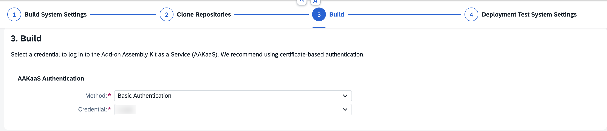

# Exercise 8 — Release, Build & Publish Product

This exercise takes the finished extension through the standard partner lifecycle: release your changes to the test system, register the Product in the Landscape Portal, build a Product Version via Test Release and Release Delivery pipelines and finally publish the Product to make it available in the chosen channel.

> **Note:** Replace `PW#` with the namespace of your system (`PW1`, `PW2`, or `PW3`) and `##` with your two-digit partner/group number wherever it appears (e.g., `09`).

---

## Release Code

1. Open **Transport Organizer** and release your task present under the system name in the **Workbench** section. To release the task, right-click it and select **Release**.

   

2. Once the task is released, release the main transport.

> **Note:** If you have completed **Exercise 6**, do not release the transport request created for that exercise.

3. Open the SAP Fiori Launchpad of the Test system.

4. Search for and open the **Import Collection** app.

5. Search for your software component `/PW#/P##EXT`.

   > **Note:** It may take some time for the object to be reflected in the **Import Collection** app after releasing the TR. Please wait for a few minutes.

6. Import those entries in order of their version number (if multiple entries exist). To import, choose the entry and click **Check and Import**. 

   

7. In the subsequent screen, click on `Import`. Wait for a few seconds for the Import to be completed.

   

---

## Test in the Test System

After the transport is imported, verify the solution works end to end in the test system before proceeding with the product build.

### Create the Business Role

The Business Role Template `/PW#/P##_BRT_SO_EXT` — which carries all three business catalogs (`/PW#/P##_BCM_MAINT_BC`, `/PW#/P##_EMAIL_JOB_BC` and `/PW#/P##_AUDIT_LOG_BC`) — is transported to the test system with the request. Business roles themselves are not transported, so create one Business Role from the transported template and assign it to your user, following the same steps as in [Exercise 5 — Create Business Role from Template](05_Exercise.md#create-business-role-from-template):

- **Template:** `/PW#/P##_BRT_SO_EXT`
- **New Business Role ID:** `PW#_P##_BR_SO_EXT`
- **New Business Role Description:** `P## Business Role for Sales Order Extension`

### Run the End-to-End Test

Once the role is assigned, repeat all the test steps from [Exercise 7 — End-to-End Scenario Test](07_Exercise.md) in the test system. Confirm that:

- Business configuration data is entered in the **Custom Business Configurations** app (CBC data does not transport — it must be re-entered).
- The event handler triggers and creates a log entry on Sales Order creation.
- The correct action and delivery block are applied.
- The Application Job is re-scheduled and email notification is sent.
- The Audit Log Fiori app displays the results.

---
## Understanding Scalable Delivery

With **scalable delivery**, partners develop ABAP Cloud extensions on SAP S/4HANA Cloud and distribute them as **add-on products**. Customers then install and consume these add-ons directly within their own system landscapes.

Use scalable delivery when your ABAP development needs to reach external SAP S/4HANA Cloud landscapes across an unlimited number of customers.

The end-to-end process consists of three core components:

- **Partner landscape**: Where you develop the extension and package it as an add-on.
- **Customer landscape**: Where the customer deploys and consumes the extension.
- **Landscape Portal for SAP S/4HANA Cloud (on SAP BTP)**: The central bridge connecting both landscapes, used by partners and customers to manage the lifecycle.

**Learn more:**

- [Scalable Delivery](https://help.sap.com/docs/SAP_S4HANA_CLOUD/6aa39f1ac05441e5a23f484f31e477e7/bcdc44683ece4f11a399b3f148a8bb22.html?locale=en-US&version=2608.500&ai=true)
- [Landscape Portal for SAP S/4HANA Cloud](https://help.sap.com/docs/SAP_S4HANA_CLOUD/6aa39f1ac05441e5a23f484f31e477e7/54e6dfd7bdaf400e917c29df533d0859.html?locale=en-US&version=2608.500&ai=true)

## Create Product

1. Open **Landscape Portal**. Go to the **Partner** section.

   

2. Click **Register Product**.

3. Click **Create** and enter the product name `/PW#/P##EXT`.

4. Search for the created product. Creation Status will show as **Pending**.

   

   After a few minutes, the status will change to **Completed**.

---

## Build Product

1. Open the **Build Product Version** app.

2. Search for your product and click it.

3. Go to the **Template** section.

4. Choose the template to configure. Configure **Test Release Delivery** first — it validates that a product version can be built without creating a new productive version. You will repeat these steps later for **Release Delivery**, which builds the actual deliverable product version.

5. Select your test system in the **System URL** field and select `assembly-user` in the **Credential Name** field. Click **Step 2**.

6. Choose **Clone** as the clone strategy.

   

   Click **Step 3**.

7. Choose `Basic Authentication` in the **Method** field and select `s-user` in **Credential** field.

   

   Click **Finish**.

8. Follow steps 3–7 for the **Release Delivery** template as well (choosing **Release Delivery** in step 4). The Release Delivery template has one additional step: provide the System Number of the Showcase system and select `lp-service-key` in the **Credential Name** field.

   

   Click **Finish**.

9. After both templates are created, go to the **Product Versions** tab, click **Create**, choose **Delivery** or **Test** and choose the configured template.

10. Add software components to your new product version. For each software component, specify the version, branch, commit ID and the languages to be built.

    

    > **Commit ID** can be found in the **Manage Software Components** app, in the **List of Commits** section, by choosing the latest commit.

    

    You can change the order of how the software components are imported via drag and drop in the table, or by choosing a component and moving it using the arrows on the right.

11. Click **Build Product Version** to trigger the build of the pipeline for your new product version.

12. You will be redirected to the **Pipeline Status** screen, where you can track the progress of your build.

---

## Publish Product

1. Search for and open the **Publish Product** app.

2. Open your product.

3. Choose the Product Version to be published and choose the **Active Channel** for publishing.

4. Choose **Solution ID** and **Edition ID**.

   

5. Click **Publish**.
