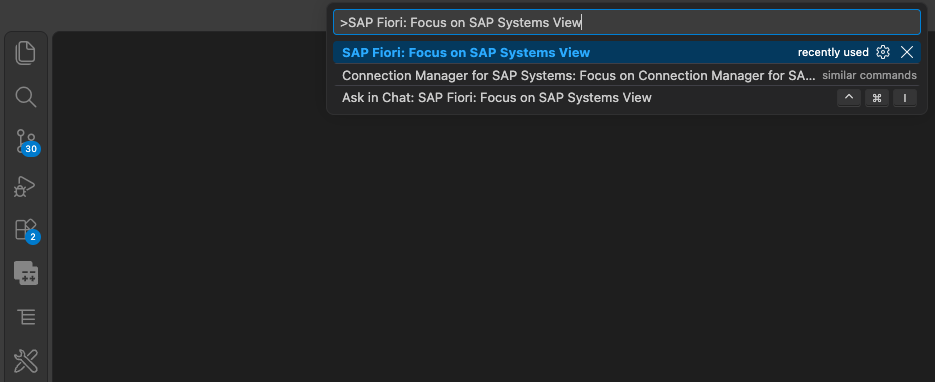
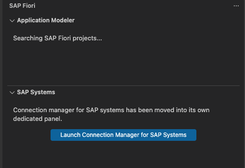
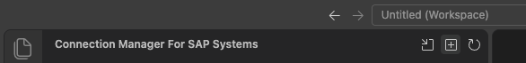
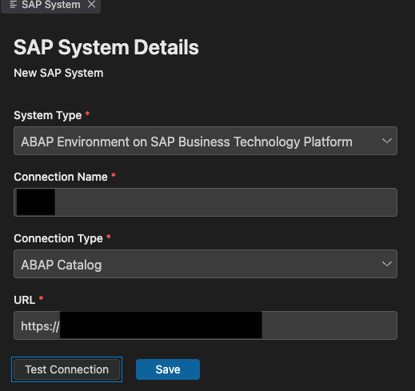
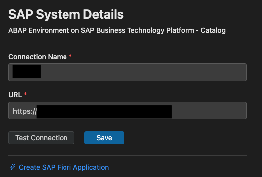

# SAP Fiori Tools in VS Code

This guide is an alternative to SAP Business Application Studio (BAS). It walks through installing Visual Studio Code with the SAP Fiori Tools Extension Pack, connecting it to your S/4HANA system and launching the SAP Fiori Application Generator to create the audit log app from [Exercise 5](../Tutorials/05_Exercise.md). Follow the official installation steps in [Set Up SAP Fiori Tools in Your Development Environment](https://developers.sap.com/tutorials/fiori-tools-vscode-setup/).

## Install VS Code and the SAP Fiori Tools Extension

1. Download VS Code from [code.visualstudio.com](https://code.visualstudio.com).
2. Install the **[SAP Fiori Tools - Extension Pack](https://marketplace.visualstudio.com/items?itemName=SAPSE.sap-ux-fiori-tools-extension-pack)** extension from the VS Code Marketplace.

## Add an ABAP System

1. After the installation of the SAP Fiori Tools extension press `Ctrl+Shift+P` (or `Cmd+Shift+P` on macOS) to open the **Command Palette**, type **SAP Fiori: Focus on SAP Systems View** and select it.

   

2. In the SAP Fiori extension click **Launch Connection Manager for SAP Systems**.

   

3. Click the **plus (+)** icon to add a new SAP System.

   

4. Add a new System with the following details:
   - **System Type:** `ABAP Environment on SAP Business Technology Platform`.
   - **Connection Name:** your S/4HANA system name.
   - **Connection Type:** ABAP Catalog.
   - **URL:** the URL to your S/4HANA system.

   > **Note:** When connecting to an SAP S/4HANA Cloud system, enter the API URL (**-api.lab.s4hana.cloud.sap**) rather than the standard UI URL (**.lab.s4hana.cloud.sap**) in the connection settings.

   

5. Click **Test Connection**. A logon screen opens in the browser.

6. Click **Save**.

## Create the SAP Fiori Application

Click **Create SAP Fiori Application** in the SAP Fiori panel.

Then follow the steps described in [Step 1 — Template Selection](../Tutorials/05_Exercise.md#step-1--template-selection).
